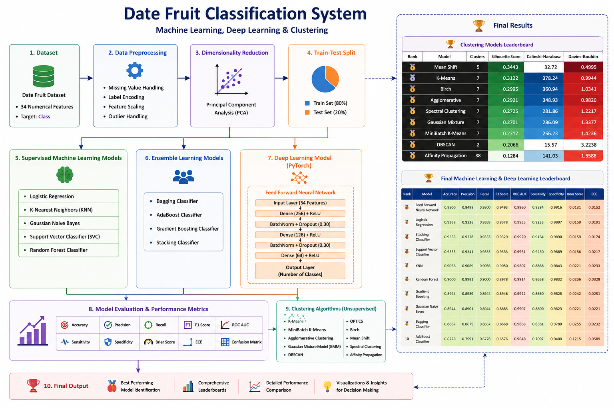

#  Date Fruit Classification using Machine Learning & Deep Learning

<p align="center">
  
</p>

##  Overview

This project presents a comprehensive comparative study of **Machine Learning**, **Ensemble Learning**, **Clustering**, and **Deep Learning (PyTorch)** techniques for **Date Fruit Classification**.

The dataset contains **34 numerical features** extracted from date fruit images, including geometric, morphological, color, texture, and wavelet-based characteristics. The data undergoes preprocessing, feature scaling, and **Principal Component Analysis (PCA)** before training multiple machine learning models. Additionally, a **Feed Forward Neural Network (FNN)** is implemented using **PyTorch** for deep learning-based classification.

The models are evaluated using multiple performance metrics, including **Accuracy, Precision, Recall, F1-Score, ROC-AUC, Sensitivity, Specificity, Brier Score, and Expected Calibration Error (ECE)**, followed by a comprehensive leaderboard for performance comparison.

<p align="center">
  

  


</p>

---

#  Objectives

- Perform data preprocessing and feature scaling.
- Apply Principal Component Analysis (PCA) for dimensionality reduction.
- Train multiple supervised Machine Learning models.
- Apply Ensemble Learning techniques.
- Explore various Clustering algorithms.
- Develop a Feed Forward Neural Network (FNN) using PyTorch.
- Compare all models using multiple evaluation metrics.
- Identify the best-performing model using a leaderboard.

---

#  Dataset

### Dataset Information

- **Dataset Name:** Date Fruit Dataset
- **Problem Type:** Multi-Class Classification
- **Target Column:** `Class`
- **Total Features:** 34 Numerical Features

### Feature Categories

- Geometric Features
- Shape Features
- Texture Features
- Color Features
- Wavelet Features

---

#  Project Workflow

```
Dataset
   │
   ▼
Data Preprocessing
   │
   ├── Missing Value Handling
   ├── Feature Scaling
   └── Label Encoding
   │
   ▼
Principal Component Analysis (PCA)
   │
   ▼
Train-Test Split
   │
   ├──────────────► Machine Learning Models
   │
   ├──────────────► Ensemble Learning Models
   │
   ├──────────────► Clustering Algorithms
   │
   └──────────────► PyTorch Feed Forward Neural Network
                           │
                           ▼
                 Model Evaluation & Comparison
                           │
                           ▼
                  Final Performance Leaderboard
```

---

#  Supervised Machine Learning Models

- Logistic Regression
- K-Nearest Neighbors (KNN)
- Gaussian Naive Bayes
- Support Vector Classifier (SVC)
- Random Forest Classifier

---

#  Ensemble Learning Models

- Bagging Classifier
- AdaBoost Classifier
- Gradient Boosting Classifier
- Stacking Classifier

---

#  Unsupervised Clustering Algorithms

- K-Means
- MiniBatch K-Means
- Agglomerative Clustering
- Gaussian Mixture Model (GMM)
- DBSCAN
- OPTICS
- Birch
- Mean Shift
- Spectral Clustering
- Affinity Propagation

---

#  Deep Learning Model

### Feed Forward Neural Network (PyTorch)

```
Input Layer (34 Features)
        │
        ▼
Linear (256)
Batch Normalization
ReLU
Dropout (0.30)
        │
        ▼
Linear (128)
Batch Normalization
ReLU
Dropout (0.30)
        │
        ▼
Linear (64)
ReLU
        │
        ▼
Output Layer
(Number of Classes)
```

---

#  Evaluation Metrics

Each classification model is evaluated using:

-  Accuracy
-  Precision
-  Recall
-  F1-Score
-  ROC-AUC Score
-  Sensitivity
-  Specificity
-  Expected Calibration Error (ECE)
-  Brier Score

---

#  Visualizations

The notebook includes:

- PCA Explained Variance Plot
- Confusion Matrix
- ROC Curve
- Train vs Test Loss Curve
- Train vs Test Accuracy Curve
- Accuracy Comparison Chart
- Clustering Visualization
- Clustering Leaderboard
- Final Model Leaderboard

---

#  Model Comparison

A comprehensive leaderboard is generated to compare all supervised models based on:

- 🥇 Accuracy
- Precision
- Recall
- F1-Score
- ROC-AUC
- Sensitivity
- Specificity
- Brier Score
- Expected Calibration Error (ECE)

---

#  Technologies Used

| Category | Libraries |
|----------|-----------|
| Programming Language | Python |
| Data Analysis | NumPy, Pandas |
| Visualization | Matplotlib, Seaborn |
| Machine Learning | Scikit-learn |
| Deep Learning | PyTorch |
| Development Environment | Jupyter Notebook |

---

#  Project Structure

```
DateFruit-Classification-Using-ML-DL/
│
├── Dataset/
│   └── DateFruit_Dataset.csv
│
│
├── Notebook/
│   └── DateFruit_Classification_ML_DL.ipynb
│
├── Images/
│   ├── Architecture.png
│   ├── Class Distribution.png
|   ├── PCA Explained Varience.png
│   ├── Classification Report-Logistic Regression.png
│   ├── Confusion Matrix-Logistic Regression.png
│   ├── ROC-AUC Curve-Logistic Regression.png
│   ├── Classification Report-KNN.png
|   ├── Confusion Matrix-KNN.png
|   ├── ROC-AUC Curve.png
|   ├── Classification Report-Naive Bayes.png
|   ├── Confusion Matrix-Naive Bayes.png
|   ├── ROC-AUC Curve-Naive Bayes.png
|   ├── Classification Report-Support Vector Classifier.png
|   ├── Confusion Matrix-Support Vector Classifier.png
|   ├── ROC-AUC Curve-Support Vector Classifier.png
|   ├── Classification Report-Random Forest Classifier.png
|   ├── Confusion Matrix-Random Forest Classifier.png
|   ├── ROC-AUC Curve-Random Forest Classifier.png
|   ├── Classification Report-Bagging Classifier.png
|   ├── Confusion Matrix-Bagging Classifier.png
|   ├── ROC-AUC Curve-Bagging Classifier.png
|   ├── Classification Report-AdaBoost Classifier.png
|   ├── Confusion Matrix-AdaBoost Classifier.png
|   ├── ROC-AUC Curve-AdaBoost Classifier.png
|   ├── Classification Report-Gradient Boosting.png
|   ├── Confusion Matrix-Gradient Boosting.png
|   ├── ROC-AUC Curve-Gradient Boosting.png
|   ├── Classification Report-Stacking Classifier.png
|   ├── Confusion Matrix-Stacking Classifier.png
|   ├── ROC-AUC Curve-Stacking Classifier.png
|   ├── K-Means Clustering.png
|   ├── MiniBatch K-Means Clustering.png
|   ├── Agglomerative Clustering.png
|   ├── Gaussian Mixture Model.png
|   ├── DBSCAN Clustering.png
|   ├── OPTICS Clustering.png
|   ├── Birch Clustering.png
|   ├── Mean Shift Clustering.png
|   ├── Spectral Clustering.png
|   ├── Affinity Propagation.png
|   ├── Clustering Models Leaderboard.png
|   ├── Train Test Loss Curve.png
|   ├── Train Test Accuracy Curve.png
|   ├── Classification Report-FNN.png
|   ├── Confusion Matrix-FNN.png
|   ├── ROC-AUC Curve-FNN.png
|   ├── ML & DL Leaderboard.png
│   └── Accuracy Comparison
│
├── Results/
│   ├── Final_Model_Leaderboard.csv
│   └── Clustering_Leaderboard.csv
│
├── Requirements.txt
└── README.md
```

---

#  Getting Started

Install all required dependencies:

```bash
pip install -r Requirements.txt
```

Open the notebook in **Jupyter Notebook** or **JupyterLab** and execute the cells sequentially.

---

#  Results

- Applied **9 supervised Machine Learning models**.
- Implemented **10 clustering algorithms** for unsupervised analysis.
- Developed a **PyTorch Feed Forward Neural Network**.
- Compared all classification models using multiple evaluation metrics.
- Generated professional leaderboards and visualizations for performance analysis.

---

#  Future Improvements

- Hyperparameter Optimization
- XGBoost, LightGBM & CatBoost Integration
- Explainable AI (SHAP & LIME)
- Model Deployment using Streamlit or Flask
- Cross-Validation based Model Selection

---

#  Author

**Soumya Kanti Upadhyay**

B.Tech in Computer Science & Engineering  
Jalpaiguri Government Engineering College

---
